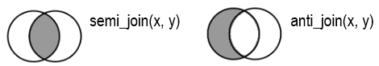

# **Joins**
Combining two data frames seems easy if the rows are perfectly aligned. However, the order of the rows in two data frames is usually messy in reality, as shown in the following figure. That's where keys come into place. This section introduces how to join two data frames based on the identified keys.
<p align="center">

</p>
*Source: Brad Cannell, [R for Epidemiology](https://www.r4epi.com/working-with-multiple-data-frames.html#relationship-types)*

## Mutating join
Description in R Document mutate-joins {dplyr} [Package dplyr version 1.0.10]
{: .label .label-red}
> The mutating joins add columns from y to x, matching rows based on the keys:  
* inner_join(): includes all rows in x and y.  
* left_join(): includes all rows in x.  
* right_join(): includes all rows in y.  
* full_join(): includes all rows in x or y.  


<p align="center">
  
</p>  
*Source: Hadley Wickham & Garrett Grolemund, [R for Data Science (2e)](https://r4ds.hadley.nz/joins.html#how-do-joins-work)*

### Examples of mutating joins in R
Input
{: .label .label-green}
```r
# run the following code line by line
# after run each line, look at the help tab in the right bottom
# scroll down to the examples section and run examples
?inner_join
?full_join
?left_join
?right_join
```

### Practice  
*Source: Jeffrey B. Arnold, [R for Data Science Exercise Solutions](https://jrnold.github.io/r4ds-exercise-solutions/relational-data.html#exercise-13.4.4)*  
> What weather conditions make it more likely to see a delay?

Step 1
{: .label .label-step}
Join the `weather` and `flights` data frames. What type of join to use? What is the key?

Input
{: .label .label-green}
```r
weather_flights <- weather %>%
  ?_join(flights, by = "")
```

Step 2
{: .label .label-step}
Select the necessary variables, weather conditions from `temp` to `visib` and `dep_delay`.

Input
{: .label .label-green}
```r
use_weather_flights <- weather_flights %>%
  select()
```

Step 3
{: .label .label-step}
Visualize the relationship between each weather condition and departure delay.

Input
{: .label .label-green}
```r
use_weather_flights %>%
  group_by(?) %>%
  summarise(delay = mean(dep_delay, na.rm = TRUE)) %>%
  ggplot(aes(x = ?, y = delay)) +
  geom_line() + geom_point()
```

## Filtering join
Description in R Document filter-joins {dplyr} [Package dplyr version 1.0.10]
{: .label .label-red}
> Filtering joins filter rows from x based on the presence or absence of matches in y:  
* semi_join() return all rows from x with a match in y.
* anti_join() return all rows from x without a match in y.

<p align="center">
  
</p>

### Examples of filtering joins in R
Input
{: .label .label-green}
```r
# run the following code line by line
# after run each line, look at the help tab in the right bottom
# scroll down to the examples section and run examples
?semi_join
?anti_join
```

### Practice  
*Source: Jeffrey B. Arnold, [R for Data Science Exercise Solutions](https://jrnold.github.io/r4ds-exercise-solutions/relational-data.html#exercise-13.5.4)*  
> Find the 48 hours (over the course of the whole year) that have the worst departure delays. Cross-reference it with the weather data. Can you see any patterns?

Step 1
{: .label .label-step}
To find the 48 hours with the worst departure delays, group flights by hour of scheduled departure time and calculate the average delay, arrange by delay, and select the 48 observations (hours) with the highest average delay.

Input
{: .label .label-green}
```r
worst_hours <- flights %>%
  mutate(hour = sched_dep_time %/% 100) %>%
  group_by(origin, time_hour) %>%
  summarise(dep_delay = mean(dep_delay, na.rm = TRUE)) %>%
  ungroup() %>%
  arrange(desc(dep_delay)) %>%
  slice(1:48)
```

Step 2
{: .label .label-step}
To get the weather for these hours, choose a type of filtering joins.

Input
{: .label .label-green}
```r
weather_most_delayed <- ?_join(weather, worst_hours, by = c("origin", "time_hour"))
```

Step 3
{: .label .label-step}
To get the weather for hours except for those hours, choose a type of filtering joins.

Input
{: .label .label-green}
```r
weather_less_delayed <- ?_join(weather, worst_hours, by = c("origin", "time_hour"))
```

Step 4
{: .label .label-step}
Compare the average weather conditions in the most and less delayed hours.

Input
{: .label .label-green}
```r
weather_less_delayed <- weather_less_delayed %>%
  mutate(most_delayed = 'no')

weather_most_delayed %>%
  mutate(most_delayed = 'yes') %>%
  rows_append(weather_less_delayed) %>%
  group_by(most_delayed) %>%
  summarise(temp = mean(temp, na.rm = TRUE),
            dewp = mean(dewp, na.rm = TRUE),
            humid = mean(humid, na.rm = TRUE),
            wind_speed = mean(wind_speed, na.rm = TRUE),
            precip = mean(precip, na.rm = TRUE),
            visib = mean(visib, na.rm = TRUE))
```
